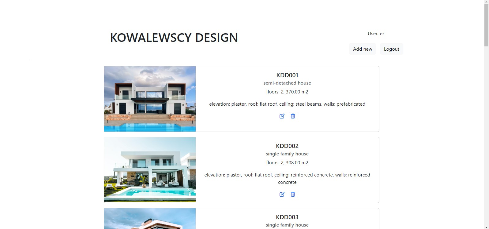
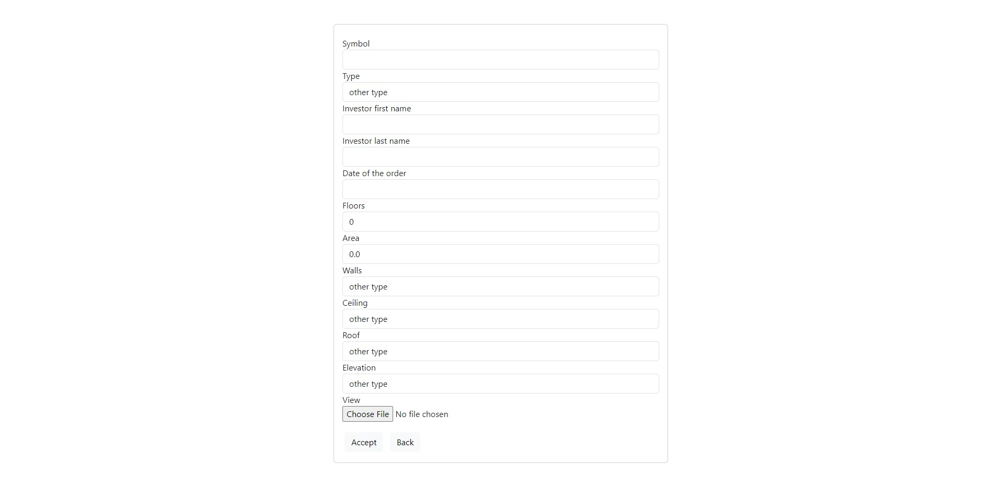
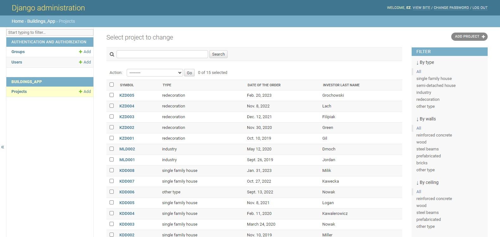
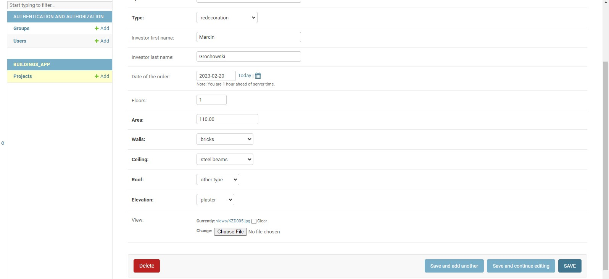

# WEB APPLICATION
## GENERAL INFO
Design studio website that presents company’s portfolio and allows logged-in users to add, edit or delete projects.
https://projektdjango1.pythonanywhere.com/design/all/

## TECHNOLOGIES & SYSTEMS
* Python
* Django
* Bootstrap
* HTML
* CSS
* PyCharm
* GitBash

## DETAILS
The project list page displays a collection of projects with their symbols, descriptions and images. 

The application allows users to log in and manage projects by adding, editing and deleting them.

  

It also provides an admin interface.

Administrators can perform additional tasks such as adding, editing and filtering the list of projects based on parameters.

## TODO
- Implement the functionality for users to click on individual projects and view more details.

## INSTALLATION
1.	Clone the repository:
git clone https://github.com/ewazalewska/design.git
2.	Navigate to the project directory:
cd design
3.	Install the dependencies:
pip install -r requirements.txt
4.	Run the development server:
python manage.py runserver
5.	Access the application in your web browser at http://localhost:8000/design/all

## SOURCES
* https://docs.djangoproject.com/en/4.1/
* inspired by https://www.udemy.com/course/django-po-polsku-podstawy/learn/lecture/10817412#overview
### DEPLOYMENT
* https://help.pythonanywhere.com/pages/DeployExistingDjangoProject/
### FOTOGRAPHS
* https://www.pexels.com/pl-pl/
* https://unsplash.com/
### ICONS
* https://fontawesome.com/

